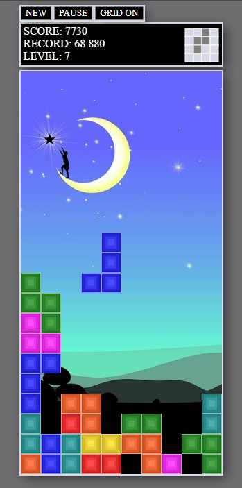
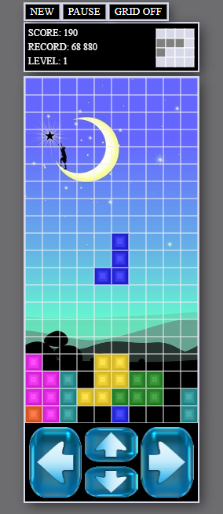
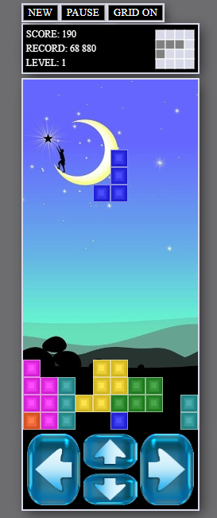

# Javascript Tetris Game

## Demo (Web)

https://moszkva44.github.io/tetris/app/src/main/assets/index.html

## Demo (Android)

https://github.com/moszkva44/tetris/releases/tag/android-release

#  

## Features

* cross-browser compatibility (supported by modern browsers)

* responsive design (desktop and most mobile devices can render it)

* follows well-known Tetris rules with naïve gravity or cascade gravity (it is up to you whether you choose)

* uses original Nintendo scoring

* 15 levels (once you reach a level you unlock it and next time you can start the game from that level if you wish)

* grid lines can be either turned on or turned off

  

* displays next coming shape

* saves and displays highest reached score

* the game can be paused

* Ads free

  

## Controlling

* On desktop you can use arrow keys to control the falling shape. To rotate the shape, use the up key.

* On mobile devices there is a dedicated input pad in the footer section that you can use to control the falling shape. The control mechanism is the same as described above.

  

## Credits

Developed by Moszkva (2025)

